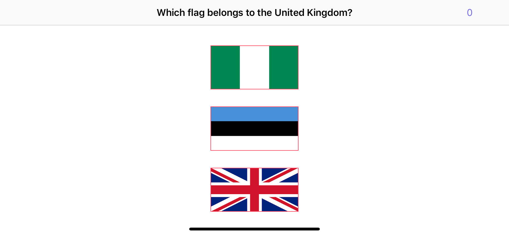

# Day 30: Project 6, Part One

_Follow along at https://www.hackingwithswift.com/100/30_.


## 📒 Field Notes

This day covers the first part of `Project 6: Auto Layout` in _[Hacking with Swift](https://www.hackingwithswift.com/read/6)_.

I have a [separate repository](https://github.com/CypherPoet/book--hacking-with-swift) where I've been creating projects alongside the material in the book. And you can find Project 6 [here](https://github.com/CypherPoet/book--hacking-with-swift/tree/master/06-auto-layout). However, I also copied it over to this day's folder so I can extend from where I left off.

With that in mind, Day 30 focuses on several specific topics:

- Advanced Auto Layout
- Auto Layout in code: addConstraints() with Visual Format Language


### Advanced Auto Layout

Using Auto Layout to get our vertical stack of flags viewable &mdash; all at once &mdash; in landscape mode comes with some nuance.

Initially setting the "Bottom Space to Safe Area" constraint on the bottom flag (I tend to think of this process as "pinning") gives it a fixed, _constant_ amount of spacing with a `Relation` of `Equal`. This leads to Auto Layout stretching or squeezing content in order to meet those demands &mdash; and in this case, the flags get squeezed to 0 in landscape mode (because the constant value is greater than the height of the entire screen!).

And there's a lesson in that: Auto Layout constraints can be used for flexibility &mdash; but they can also be used for precision and concreteness. We want the flexibility.

By changing the `Relation` from `Equal` to `Greater Than or Equal`, and the `Constant` to `20`, we unlock just that. Alas, it's still not perfect &mdash; Auto Layout still squashes _one_ flag in the middle &mdash; But Auto Layout has options now. And we only need a few more tweaks on top:

- Set each flag to be of `Equal Heights` with respect to its adjacent flag. Now an odd flag won't be resized.
- Add the `Aspect Ratio` constraint to each flag, internally, so that width will be resized in accordance with any changes to height.

Presto 💥




### Auto Layout in code: addConstraints() with Visual Format Language


Apple's documentation provides a handy [description of the full specification](https://developer.apple.com/library/archive/documentation/UserExperience/Conceptual/AutolayoutPG/VisualFormatLanguage.html), but the core idea is that VFL allows us to programmatically (thus, dynamically) define horizontal and vertical layout, alignment, and sizing constraints for views that might otherwise not be possible &mdash; or straightforward &mdash; in Interface Builder.

Using a string like this...

```swift
V:|[label1(labelHeight@999)]-[label2(label1)]-[label3(label1)]-[label4(label1)]-[label5(label1)]->=10-|
```

... we can encode an immense amount of information: direction, alignment, element sizing, element spacing, edge offsets, and event constraint priority levels (designated above by the `@999`).

Actually _activating_ these constraints for a view can get a bit verbose, since we need to make use of `NSLayoutConstraint`, but it's not too bad if we organize values in variables:

```swift
view.addConstraints(
    NSLayoutConstraint.constraints(
        withVisualFormat: layoutString,
        options: [],
        metrics: metrics,
        views: labelViews
    )
)
```

Some important pointers and code architecture:
- Views need to be structured as a dictionary. VFL processes this dictionary and makes use of the key names to interpret its string.
- For views that we're using VFL with, `translatesAutoresizingMaskIntoConstraints` needs to be set to `false`. It's [`true` by default for any view created programmatically](https://developer.apple.com/documentation/uikit/uiview/1622572-translatesautoresizingmaskintoco) &mdash; but we'll be writing the constraints, thank you very much 😀.
- Vertical pipes `|` refer to edges, and omitting them or adding them can makes the difference between items being stretched end-to-end or not.


## 🔗 Additional/Related Links

- [Exploring Visual Format Language with Swift](https://medium.com/@Cordavi/exploring-visual-format-language-with-swift-7ba2c1f4c924)
